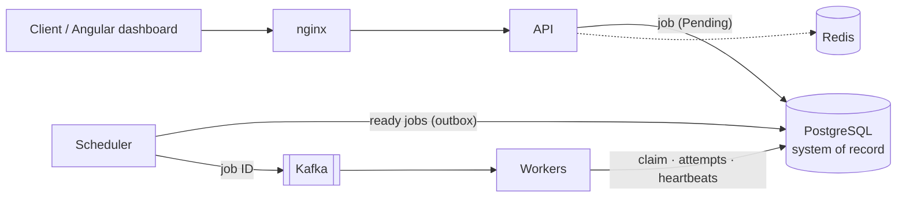

# Reeve

A distributed job orchestration platform: clients submit asynchronous jobs, and Reeve runs
them reliably across worker processes that can crash, messages that can arrive twice and
infrastructure that can restart. Built with C# / .NET 10, ASP.NET Core, PostgreSQL, Kafka, Redis
and Angular, and deployed with Docker Compose or Kubernetes.

Named after the reeve, the medieval manor official who handed out the labourers' work and made
sure it got done.

The design target is **at-least-once execution with deduplicated side effects**, not
exactly-once. It's tested by killing workers and restarting Kafka and PostgreSQL under load, and
measured.



**PostgreSQL decides, Kafka delivers.** The API only writes to the database. A dispatcher publishes
ready jobs, with the jobs table as the outbox, and a worker runs a job only after claiming it in
PostgreSQL. Duplicates, lost messages and late results from crashed workers are all resolved
there.

## Quick start

Only Docker is needed:

```bash
docker compose up -d --build --wait
```

| | |
|---|---|
| Dashboard | http://localhost:8080. Sign in as `viewer`, `operator` or `admin` (password = username) |
| API | http://localhost:8080/api/v1 |
| Grafana | http://localhost:3000 (Reeve dashboard) |
| Jaeger | http://localhost:16686 (one trace per job) |
| Prometheus | http://localhost:9090 (metrics and alerts) |

Submit a job that fails twice and then succeeds, to watch retries in the dashboard:

```bash
TOKEN=$(curl -s -X POST http://localhost:8080/api/v1/auth/token -H "Content-Type: application/json" -d '{"username":"operator","password":"operator"}' | sed -E 's/.*"accessToken":"([^"]+)".*/\1/')
```
```bash
curl -X POST http://localhost:8080/api/v1/jobs -H "Authorization: Bearer $TOKEN" -H "Content-Type: application/json" -d '{"jobType":"SEND_NOTIFICATION","payload":{"userId":5,"simulate":{"failure":"transient","failAttempts":2}},"retryPolicy":{"maxRetries":3,"backoffSeconds":1}}'
```

It runs three times, and the notification is still sent once.

## What it does

- **Jobs:** create jobs with a type, JSON payload, priority, delay or retry policy, and an
  `Idempotency-Key`. Cancel them, retry failed ones, search them, and inspect every execution
  attempt.
- **Reliable execution:**
  - Workers claim jobs under row locks, so two workers never run the same job.
  - Every attempt is recorded and fenced, so a late result from a crashed worker can't overwrite
    the retry that replaced it.
  - Timeouts are enforced even when a handler ignores cancellation.
  - Transient failures are retried with exponential backoff and jitter. Permanent failures stop
    at once, jobs that exhaust their retries are dead-lettered, and an operator can retry either.
- **Deduplicated side effects:** an effects ledger lets a retried job skip a side effect
  (sending a notification, say) that an earlier attempt already performed. An attempt that was
  cancelled or replaced skips its effects. A crash between performing an effect and recording it can
  still repeat it, which the ledger's idempotency key lets a downstream system reject.
- **Workers:** register, heartbeat, advertise their job types and concurrency, drain gracefully on
  shutdown, and recover jobs from crashed peers. Messages that can never be processed go to a
  dead-letter topic without blocking the partition.
- **Schedules:** cron expressions with time zones. Each occurrence fires exactly once, however many
  schedulers run.
- **Operations dashboard:** overview metrics, job search and detail, queues, workers and their
  heartbeat health, failures, schedules, and the audit log.
- **Security:**
  - JWT authentication with viewer, operator and admin roles; secure by default.
  - Per-user rate limits (Redis, falling back to each instance).
  - Audit events written in the same transaction as the change.
- **Observability:**
  - OpenTelemetry traces that follow a job from the request through Kafka to every attempt.
  - Prometheus metrics, 9 alert rules and a provisioned Grafana dashboard.
  - JSON logs with trace IDs.
- **Deployment:**
  - Chiseled non-root images and one-command Docker Compose.
  - Kubernetes manifests with probes designed not to restart pods during outages, autoscaling,
    disruption budgets and restricted pod security.

## Measured

On one laptop (Ryzen AI 7 350, Docker Desktop), with the load generator on the same machine,
using the driver in [tests/Reeve.LoadTests](tests/Reeve.LoadTests/README.md).

| | |
|---|---|
| Submissions | ~1,630/s at 64 connections, p99 under 120 ms |
| Execution | 1,035 jobs/s with 6 workers; 100,000 jobs with 0 failures, retries or duplicates |
| End to end | 0.48 s median, 0.84 s p99 at 400 jobs/s |
| Failure tests | Worker `kill -9`, Kafka restart, PostgreSQL restart, 30 s outage of every worker: no job lost; only the jobs on the killed worker ran again |

Measuring found seven bottlenecks, which were then fixed. For example, batching Kafka claims
multiplied worker throughput by 2.5.

## Development

Prerequisites: the .NET 10 SDK, Node.js LTS and Docker Desktop. Integration tests start their own
PostgreSQL, Kafka and Redis containers (Testcontainers), so they need Docker but not the stack.

```bash
dotnet test Reeve.slnx
```
```bash
npm --prefix frontend/reeve-ui install
```
```bash
npm --prefix frontend/reeve-ui test -- --watch=false
```

To run the .NET services from an IDE instead of containers, stop their containers (the
infrastructure stays up on localhost), apply migrations, and start the API, the scheduler and one
or more workers:

```bash
docker compose stop ui api scheduler worker
```
```bash
dotnet tool restore
```
```bash
dotnet ef database update --project src/Reeve.Infrastructure --startup-project src/Reeve.Infrastructure
```
```bash
dotnet run --project src/Reeve.Api
```
```bash
dotnet run --project src/Reeve.Scheduler
```
```bash
dotnet run --project src/Reeve.Worker
```

The dashboard's dev server (`npm --prefix frontend/reeve-ui start`, http://localhost:4200)
proxies `/api` to the API on port 5182. See also the [dashboard README](frontend/reeve-ui/README.md).

Kubernetes: `deploy/kubernetes/base` holds the application and `overlays/local` a self-contained
environment (in-cluster PostgreSQL, Kafka and Redis; dashboard on NodePort 30080). With the images
built by `docker compose build` loaded into a local cluster:

```bash
kubectl apply -k deploy/kubernetes/overlays/local
```

## Repository

| Path | |
|---|---|
| `src/Reeve.Domain` | The `Job` aggregate and its state machine, attempts, workers, schedules |
| `src/Reeve.Application` | Use cases, execution (executor, effects ledger), telemetry |
| `src/Reeve.Infrastructure` | EF Core and PostgreSQL, Kafka, Redis, health, OpenTelemetry |
| `src/Reeve.Api` | HTTP endpoints, authentication, validation, rate limiting |
| `src/Reeve.Scheduler` | Dispatcher (outbox), cron schedules, sweeper |
| `src/Reeve.Worker` | Kafka or database consumption, execution, heartbeats, recovery |
| `src/Reeve.Contracts` | Request, response and message contracts |
| `tests/` | Unit, API and integration tests (Testcontainers: real PostgreSQL, Kafka, Redis), and the load test driver |
| `frontend/reeve-ui` | Angular 22 operations dashboard |
| `deploy/` | Dockerfiles and nginx, observability configuration, Kubernetes (Kustomize) |

About 340 automated tests: 133 unit, 100 API and 52 integration tests for the backend, and 53 for
the dashboard.
